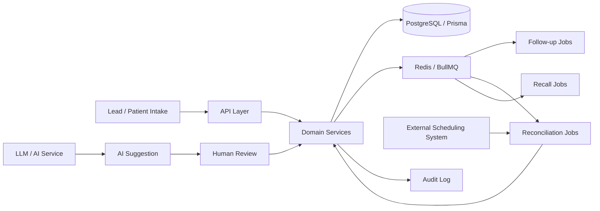

# QARA Clinical AI & Automation — Portfolio Demo

[](https://github.com/hampikamayuq/Clinical-AI-Automation/actions/workflows/ci.yml)

A privacy-safe, synthetic portfolio project demonstrating how a clinician can design reliable AI-assisted workflows for healthcare operations.

> **Portfolio/demo only.** This repository does not contain production credentials, patient data, clinic exports, or protected health information (PHI). All examples are synthetic.

## Why this project exists

Healthcare workflows are not just CRUD. They require traceability, idempotency, reconciliation with external systems, clear state transitions, human review, and careful handling of automation failures.

This project models a dermatology-clinic workflow around:

- patient and lead intake;
- appointment reconciliation;
- follow-up automation (24h/72h);
- recall tasks;
- check-in and visit completion;
- biopsy/specimen workflow;
- audit logging;
- AI-assisted triage of operational tasks with human review.

## Architecture



## Core engineering ideas

### 1. Idempotent workflow processing
Repeated webhook or reconciliation events must not create duplicate appointments, tasks, or messages.

### 2. Explicit state transitions
Clinical and operational workflows are modeled as state machines instead of free-form status edits.

### 3. Human-in-the-loop AI
AI suggestions are non-authoritative. Clinical or operational actions require deterministic rules and/or human confirmation.

### 4. Auditability
Every relevant state transition should generate an audit event containing actor, timestamp, source, and before/after state.

### 5. Synthetic data only
Examples use fictional people and identifiers.

## Example domain model

- `Patient`
- `Lead`
- `Appointment`
- `Task`
- `AuditLog`
- `DomainEvent`
- `Specimen`
- `ProcedureProposal`

## Demo workflow

1. Lead enters pipeline.
2. Patient identity is matched/deduplicated.
3. Appointment is confirmed from an external scheduling identifier.
4. Pending lead follow-ups are cancelled.
5. Check-in and visit completion produce auditable state changes.
6. If a biopsy is performed, a specimen workflow is opened.
7. Result review creates a clinician task.
8. AI may summarize operational context, but does not autonomously make clinical decisions.

## Quick start

```bash
npm install
cp .env.example .env
npm run dev
```

This starter intentionally keeps infrastructure light. The repository is structured to show architecture and domain thinking rather than claim production deployment.

## Suggested next implementation steps

- add Fastify or Express endpoints;
- connect Prisma to PostgreSQL;
- add BullMQ workers;
- implement webhook idempotency keys;
- add unit tests for state transitions;
- add OpenTelemetry traces;
- add an LLM adapter with structured outputs and redaction guardrails;
- add a simple operations dashboard.

## Skills demonstrated

`Healthcare AI` · `Clinical workflows` · `TypeScript` · `Node.js` · `REST APIs` · `PostgreSQL` · `Prisma` · `Redis` · `BullMQ` · `n8n` · `LLM workflows` · `Human-in-the-loop AI` · `Auditability` · `System design`

## Author

**Diego Ivan Galvez Sanchez**  
Physician · Dermatologist · Applied AI & Healthcare
